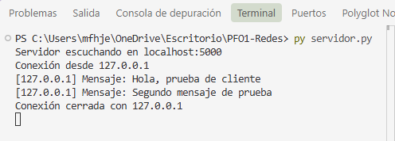
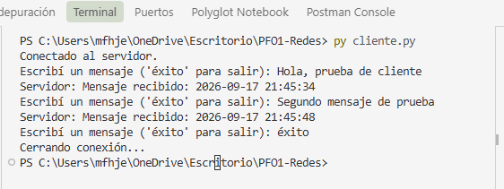
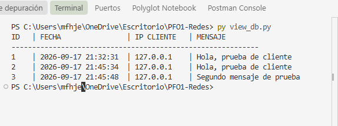

# PFO1 - Programación sobre Redes

**Instituto de Formación Técnica Superior N° 29**  
**Carrera:** Tecnicatura Superior en Desarrollo de Software  
**Año:** 2026  
**Materia:** Programación sobre Redes  
**Estudiante:** Herrera Marcela  

---

## Descripción del Proyecto

Implementación de un sistema de comunicación cliente-servidor basado en sockets TCP en Python, con soporte concurrente multicliente mediante hilos (`threading`) y persistencia de mensajes en una base de datos relacional SQLite (`mensajes.db`).

---

## Características Técnicas

* **Arquitectura Cliente-Servidor:** Comunicación TCP en `localhost:5000`.
* **Concurrencia:** Atención de múltiples clientes en paralelo a través de la librería estándar `threading`.
* **Persistencia en SQLite:** Creación y almacenamiento automático de registros en la tabla `mensajes`.
* **Estructura de la Base de Datos:**
  * `id`: Clave primaria autoincremental (`INTEGER PRIMARY KEY AUTOINCREMENT`).
  * `contenido`: Texto recibido desde el cliente (`TEXT`).
  * `fecha_envio`: Timestamp del momento de recepción (`TEXT`).
  * `ip_cliente`: Dirección IP de procedencia (`TEXT`).
* **Respuesta del Servidor:** Confirmación con formato `Mensaje recibido: <timestamp>`.
* **Condición de Salida:** Cierre ordenado de socket y conexión cuando el usuario ingresa la palabra `éxito` (sin persistir la palabra de escape en la base).

---

## Estructura de Archivos

```text
PFO1-Redes/
│
├── capturas/
│   ├── capservidro.png   # Evidencia de ejecución del servidor
│   ├── capcliente.png    # Evidencia de interacción del cliente
│   └── capviewdb.png     # Evidencia de registros en la base de datos
│
├── servidor.py           # Servidor TCP multihilo y gestión de SQLite
├── cliente.py            # Cliente interactivo por consola
├── view_db.py            # Script utilitario para consultar los registros en la DB
├── mensajes.db           # Base de datos SQLite (se genera automáticamente)
└── README.md             # Documentación del proyecto

```

---

##  Evidencia de Pruebas


### 1. Servidor TCP Multihilo
Se comprueba el inicio del servicio en el puerto 5000, la aceptación de conexiones entrantes y la recepción de datos:


### 2. Cliente 
Se valida la conexión, el envío sucesivo de mensajes, la respuesta con timestamp devuelta por el servidor y el cierre ordenado mediante la palabra `éxito`:


### 3. Persistencia en SQLite (`mensajes.db`)
Consulta directa a la base de datos mediante el script auxiliar para certificar que los campos (`id`, `contenido`, `fecha_envio`, `ip_cliente`) se registraron correctamente:
